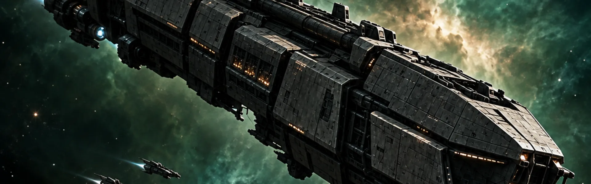
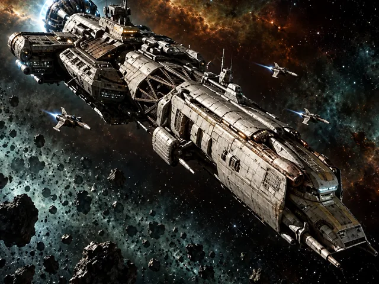

<div align="center">

<h1>Universe At War</h1>

**Build an empire. Read your rivals. Own the stars.**

A persistent, self-hosted space strategy game inspired by the timeless progression of OGame.

[](https://github.com/laulin/universe-at-war/actions/workflows/ci.yml)
[](go.mod)
[](https://www.sqlite.org/)

[Play now](#launch-your-universe) · [Explore the game](#command-your-empire) · [Read the rules](docs/rules/) · [Run your own server](docs/operations/release.md)

</div>



Universe At War is a living galaxy you can run on your own machine. Extract resources, unlock technologies, build specialized fleets, spy on neighboring worlds, and turn carefully gathered intelligence into decisive attacks. The universe keeps moving while you are away—and survives every restart.

No external database. No cloud dependency. Just one Go server, one SQLite file, and a galaxy that belongs to you.

## The galaxy is waiting

Every empire begins with a single planet and a handful of choices:

1. **Grow** your economy without exhausting energy or storage.
2. **Research** the technologies that unlock new ships, defenses, and strategic options.
3. **Scout** nearby systems and decide which reports are worth acting on.
4. **Strike, trade, colonize, or cooperate** with fleets that travel in real time.
5. **Adapt** as human and AI empires expand, ally, retaliate, and compete for the same space.

Production continues offline, construction queues finish on schedule, and fleets reach their destinations even if the server restarts. Your decisions leave a lasting mark.

## Command your empire

| | |
|---|---|
| **Build a real economy**<br>Balance metal, crystal, deuterium, energy, storage, and limited planetary fields. Queue buildings, research, ships, and defenses with transparent costs and completion times. | **Design your fleet doctrine**<br>Choose from probes, cargo ships, recyclers, colony ships, fighters, cruisers, battleships, bombers, destroyers, battlecruisers, and the Deathstar. Propulsion research changes their real speed and fuel use. |
| **Fight with intelligence**<br>Espionage reveals only what your probe strength can uncover. Simulate attacks from the information you actually possess, then risk your ships in probabilistic combat with rapid fire, loot, debris, and persistent reports. | **Expand beyond one world**<br>Colonize open coordinates, develop distinct planets, harvest debris fields, and create moons through sufficiently destructive battles. Sensor phalanxes expose movement; jump gates reshape logistics. |
| **Build alliances that matter**<br>Create ranks, invite players, manage diplomacy, share selected reports, defend allies, and coordinate multiplayer attacks that resolve as one battle. Resources always remain under each player's control. | **Venture into the unknown**<br>Send expeditions beyond the edge of a system. You may discover resources or ships, suffer delays, meet pirates or aliens, lose everything—or find nothing at all. |

### A galaxy that fights back

Server-controlled empires are not passive resource farms. They build, research, colonize, scout before attacking, remember what they have learned, lose fleets, and sleep outside their configured hours. They use the same application rules as human players and never read secret opponent state.

AI commanders can also form alliances, share intelligence, select common targets, launch coordinated attacks, and answer calls to defend an ally. Configure their number, personalities, schedules, difficulty, and alliances when creating the universe—or manage them later from the administration panel.

### Strategy with consequences

- Fleet composition, propulsion research, distance, cargo space, fuel, arrival time, and return time all matter.
- Espionage and combat reports are immutable snapshots; hidden information never leaks to the browser.
- A recalled fleet turns around instead of teleporting home.
- Colonization succeeds only if the destination is still free when the colony ship arrives.
- Group attacks share loot according to the surviving fleets' remaining cargo capacity.
- Every expedition outcome is generated once and persisted, making event processing safe to replay.

## See your empire take shape

<table>
  <tr>
    <td width="33%"></td>
    <td width="33%"></td>
    <td width="33%"></td>
  </tr>
  <tr>
    <td align="center"><strong>Shape new worlds</strong></td>
    <td align="center"><strong>Unlock new possibilities</strong></td>
    <td align="center"><strong>Project your power</strong></td>
  </tr>
</table>

The server-rendered command center keeps your current world's resources, queues, fleets, and empire within reach. Live counters and completion timers enhance the interface, while every essential action remains available without JavaScript.

## Launch your universe

### Requirements

- [Go 1.27](https://go.dev/dl/) or newer
- Git

SQLite and CGO are **not** required.

### Start playing

```sh
git clone https://github.com/laulin/universe-at-war.git
cd universe-at-war
go run ./cmd/universe-at-war serve
```

On the first launch, the terminal prints a randomly generated administrator username and password **once**. Then:

1. Open [http://127.0.0.1:8080](http://127.0.0.1:8080).
2. Sign in with the bootstrap credentials and choose a new password.
3. Complete the universe setup wizard.
4. Found your empire and make your first move.

Your entire universe is stored in `universe-at-war.db`. Stop the process with <kbd>Ctrl</kbd>+<kbd>C</kbd>; start the same command later to continue exactly where you left off.

> [!TIP]
> Want to invite other players? Enable open registration during setup and follow the [deployment guide](docs/operations/release.md) before exposing the server outside your machine.

## Built for private universes

- **Self-contained:** a single cross-platform binary with embedded migrations, web assets, and gameplay rules.
- **Persistent:** durable scheduled events recover automatically after a graceful or unexpected restart.
- **Configurable:** tune speed, economy, fleet travel, combat, registration, AI population, and more through a versioned setup wizard.
- **Operable:** built-in database diagnostics, verified backups, structured logs, account recovery, and an administration dashboard.
- **Accessible:** semantic server-rendered pages, keyboard-friendly interactions, textual alerts, and progressive enhancement.
- **Portable:** release builds target Linux, macOS, and Windows on AMD64 and ARM64 where supported.

## Operations

Common commands are available from the same executable:

```sh
# Build a local binary
make build
./bin/universe-at-war serve

# Choose another database or listen address
./bin/universe-at-war serve --database campaign.db --listen 127.0.0.1:9090

# Check database integrity and foreign keys
./bin/universe-at-war doctor --database campaign.db

# Create a verified snapshot and retain the latest 14 backups
./bin/universe-at-war backup --database campaign.db --keep 14

# Recover an administrator account
./bin/universe-at-war admin reset-password --database campaign.db --username admin
```

For TLS, public hosting, release builds, restores, and service management, see the [operations guide](docs/operations/release.md). Detailed backup procedures live in [docs/operations/backups.md](docs/operations/backups.md).

## Under the hood

Universe At War deliberately favors a small, dependable stack:

- Go standard-library HTTP server and server-rendered HTML
- Embedded static assets and SQL migrations
- Pure-Go SQLite driver with WAL-backed storage
- Transactional application services and durable scheduled events
- Structured logs with per-request correlation IDs
- Deterministic clocks and random sources for reproducible tests

The AI reaches the game exclusively through the same application services available to human actions. A structural test enforces that boundary: artificial players cannot access repositories, the database, or hidden enemy state.

Start with the [architecture overview](docs/architecture/overview.md), browse the complete [game rules](docs/rules/), or read the original [game specification](SPECIFICATION_OGAME_LOCAL_GO.md).

## Development

```sh
make check       # full test suite, go vet, and formatting check
make test-race   # race detector suite
make build       # local optimized binary
make release     # cross-platform release matrix
```

The project is developed with transaction-level tests and end-to-end acceptance scenarios for the economy, research, fleets, combat, expansion, alliances, AI, and expeditions. CI also runs Staticcheck, `govulncheck`, and cross-platform builds.

ImageMagick and `libwebp` are needed only to regenerate embedded artwork with `make art`; neither is required to build, test, or play the game. Artwork masters live in [`images/`](images/).

## Contributing

Issues, balancing feedback, bug reports, and pull requests are welcome. Before opening a pull request:

1. Keep gameplay behavior documented under [`docs/rules/`](docs/rules/).
2. Add or update tests for behavioral changes.
3. Run `make check` locally.

The universe is playable today and still evolving. If persistent strategy games are your thing, start a campaign, tell us where the tension works, and help shape what comes next.
